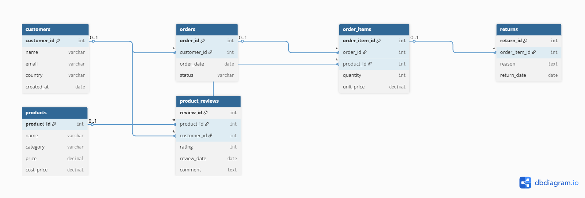

# 🛍️ E-Commerce SQL Analysis Project

## 📌 Overview
This project simulates an e-commerce platform database and demonstrates advanced SQL analytics on key business metrics such as product performance, customer spending behavior, profitability, and return rates. It's designed to showcase proficiency in writing complex SQL queries using JOINs, CTEs, aggregate functions, and window functions.

---

## 🗃️ Database Schema

The project contains 6 core tables:
- **customers**: Information about users (name, country, join date).
- **products**: Product name, category, price, and cost.
- **orders**: Order records linked to customers.
- **order_items**: Detailed list of items in each order.
- **product_reviews**: Ratings and reviews left by customers.
- **returns**: Return records with reasons and dates.

---

## 🧠 Tools & Skills Used

- **SQL (MySQL)**:  
  - JOINs  
  - GROUP BY & HAVING  
  - CTEs  
  - Window Functions  
  - Subqueries  
  - Aggregations & Calculations

- **MySQL Workbench**  
- **dbdiagram.io** (for ERD)

---

## 🔍 Analytical Questions Answered

| # | Analysis Description |
|---|-----------------------|
| 01 | Best-selling products by quantity |
| 02 | Top customers by total spending |
| 03 | Product profitability (revenue, cost, margin) |
| 04 | Customers whose spending is above average |
| 05 | Products with multiple returns |
| 06 | First order per customer using window functions |
| 07 | Product rating vs. average category rating |
| 08 | Return rate as a percentage of total items |
| 09 | Top countries by customer count |
| 10 | Repeat customers with ≥ 2 orders |

All queries are stored in the `/queries` folder with clear file names and comments.

---

## 🗺️ Entity Relationship Diagram (ERD)

---

## 🚀 How to Use

1. Run `schema.sql` to create the database structure.
2. Run `mock_data.sql` to populate sample data.
3. Run queries from the `/queries` folder using MySQL Workbench.

